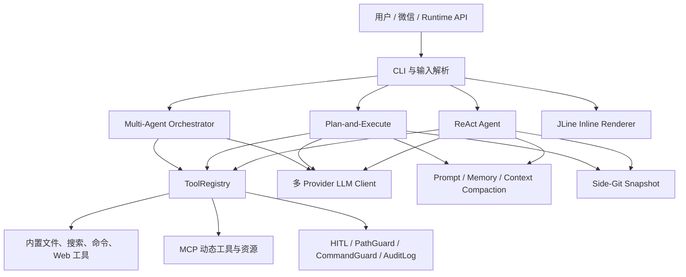

# YiCLI 项目面试深挖手册

> 适用场景：Java 后端、AI Agent、LLM 应用、基础架构、CLI 工具方向的项目面试。
>
> 使用原则：回答时先讲目标和结论，再讲核心链路、设计取舍、故障案例，最后主动说明边界。不要把路线图中的能力说成已交付能力。

## 1. 项目介绍

### 1.1 一分钟介绍

**面试题：请介绍一下 YiCLI。**

**建议回答：**

YiCLI 是一个用 Java 17 实现的 Coding Agent CLI，产品形态对标 Claude Code。它不是简单地把用户问题转发给大模型，而是让模型在一个受控循环中理解代码库、调用文件和命令工具、观察执行结果，再继续推理，直到完成任务。

系统有三条执行路径：默认的 ReAct 适合边探索边执行；Plan-and-Execute 会先生成任务 DAG，适合依赖关系明确的复杂任务；Multi-Agent 会按角色拆给多个 SubAgent，再由 Orchestrator 汇总。三条路径共享工具注册、记忆、快照和安全策略，避免不同模式的行为不一致。

我重点解决了五类工程问题：

1. Agent 循环如何可控，避免无限调用、上下文爆炸和错误累积。
2. 工具调用如何统一、并发、有序，并限制文件和命令权限。
3. 多家模型在流式协议、thinking 字段、工具调用和图片能力上的差异如何兼容。
4. MCP、浏览器、RAG、LSP 等外部能力如何动态接入和故障降级。
5. CLI 中模型流式输出、用户输入和底部状态栏如何避免争抢终端。

### 1.2 项目架构

### 1.3 最能体现技术深度的三个点

**面试题：这个项目最难的部分是什么？**

**建议回答：**

第一是“可控的 Agent 循环”。难点不是调用一次模型，而是维护 assistant tool call、tool result、reasoning、token 预算和终止条件的一致状态。任何一条消息丢失或顺序错误，都可能导致模型拒绝请求或重复执行工具。

第二是“终端并发渲染”。LLM 流、MCP 启动日志、索引进度、LineReader 输入行和底部状态栏都可能同时写终端。最终通过统一 `Renderer.stream()`、JLine `printAbove` 和 `Status` 托管底部区域来划清输出所有权。

第三是“能力与安全同时扩展”。文件写入、Shell、MCP、浏览器、微信远程入口的风险等级不同。系统使用 HITL、工具策略、路径边界、命令规则和审计日志分层拦截，并明确承认当前不是容器级沙箱。

## 2. ReAct Agent

### Q1：ReAct 循环是怎样运行的？

**建议回答：**

`Agent.java` 维护会话历史。每次迭代把 system prompt、历史消息和工具 schema 发给模型。模型如果返回 tool calls，就先把 assistant 消息完整加入历史，再通过统一的 `ToolRegistry.executeTools()` 执行工具，把每个结果作为 tool message 回灌，进入下一轮；如果没有 tool call，就把 content 作为最终答案结束。

实现上必须保证 assistant tool call 与对应 tool result 成对出现。DeepSeek V4 或 Kimi thinking 模式还要求把 `reasoning_content` 随 assistant tool-call 历史带回下一轮，否则上游可能报协议错误或丢失推理上下文。

### Q2：如何避免 Agent 无限循环？

**建议回答：**

我不会只依赖模型“自觉结束”，而是从多个维度施加预算：迭代次数、工具调用数量、重复调用、上下文 token 和具体执行路径的任务预算。达到限制时明确终止并返回可诊断信息。工具错误会作为结构化观察返回模型，让模型有机会修正参数，但不会无限重试同一个失败动作。

进一步可以追问的指标包括：每轮迭代数分布、重复工具调用率、工具失败率、首次有效操作耗时和任务成功率。

### Q3：为什么默认用 ReAct，而不是先规划再执行？

**建议回答：**

代码任务通常一开始信息不足。比如“修复登录失败”需要先搜符号、读调用链、再根据结果决定下一步。强制预先生成完整计划会基于不完整上下文做出很多假设。ReAct 更适合低成本、渐进式探索；只有任务较大、依赖明确、用户需要审阅计划时才切换 `/plan`。

### Q4：工具执行失败后怎么处理？

**建议回答：**

工具失败不是直接抛到 CLI 结束，而是转成模型可理解的 tool result，包含错误类型和必要上下文。模型可以改参数或换工具。安全策略拒绝则不同：拒绝结果必须明确，不允许模型通过换一种表达绕过。系统异常会记录日志，用户输出中保留可操作信息，同时避免泄露密钥和无关堆栈。

### Q5：流式回答和工具调用如何共存？

**建议回答：**

流式事件至少包括 reasoning delta、content delta、tool-call delta 和结束事件。渲染器按状态分区：content 或 tool call 开始前先结束 live thinking 区；完整 reasoning 再落到 transcript。服务端有时会在 content 之后继续发 reasoning，因此不能假设事件严格单向切换，状态机需要容忍乱序边缘情况。

## 3. Plan-and-Execute 与 DAG

### Q1：Plan 模式如何工作？

**建议回答：**

Planner 先把目标拆成带 ID、依赖和验收标准的 Task，构成 `ExecutionPlan`。用户可以直接执行、展开查看、取消，或补充信息后重新规划。执行器只调度依赖已完成的任务；一个任务内部仍然是小型 ReAct 循环，因此计划负责宏观依赖，Agent 负责局部探索。

### Q2：为什么用 DAG，而不是普通任务列表？

**建议回答：**

线性列表会把本来独立的任务串行化，也无法准确表达“C 同时依赖 A、B”。DAG 可以做拓扑调度：同层无依赖任务可并行，依赖失败时阻止下游执行。创建计划时还要检查不存在的依赖、自依赖和环，执行时记录 pending、running、completed、failed 等状态。

### Q3：并行执行 DAG 有什么风险？

**建议回答：**

最大的风险是多个任务同时修改同一文件，产生逻辑覆盖；其次是并发工具导致资源过载和输出乱序。系统的并行不是“能并就全并”，只有依赖允许且操作风险可控时才并行，并设置并发上限。结果按原始任务顺序整理，写操作还受 HITL、路径策略和快照保护。更严格的演进方向是增加文件级意图锁或变更集合并。

### Q4：计划和实际情况不一致怎么办？

**建议回答：**

计划不是不可变合同。任务执行时仍能探索；发现关键假设错误，可以失败并带原因返回，或由用户通过审阅交互补充信息后重规划。设计重点是保留可解释的状态变化，而不是为了“计划完成率”硬执行错误步骤。

## 4. Multi-Agent

### Q1：Multi-Agent 是不是简单开多个线程？

**建议回答：**

不是。`AgentOrchestrator` 负责目标拆分、角色选择、消息路由、预算和最终汇总，`SubAgent` 在受限上下文中执行自己的任务。并发只是实现手段，核心是上下文隔离和协作协议，否则多个 Agent 会重复读取、互相覆盖或消耗成倍 token。

### Q2：如何防止多个 Agent 重复劳动？

**建议回答：**

任务描述要包含边界、输入、预期输出和依赖；SubAgent 只接收完成任务所需的上下文，结果通过结构化消息回到 Orchestrator。共享事实应由 Orchestrator 汇总，而不是让每个 Agent 拿完整会话自由探索。还需要以任务 ID 关联日志和 token 成本，才能定位重复工作。

### Q3：什么时候不应该使用 Multi-Agent？

**建议回答：**

单文件修复、强顺序依赖、上下文高度耦合的任务通常不适合。Multi-Agent 会增加模型调用、协调延迟和冲突概率。只有可独立拆分的跨模块分析、并行调查或多角色评审，收益才可能覆盖协调成本。

### Q4：如何评价 Multi-Agent 效果？

**建议回答：**

不能只看总耗时。应同时比较任务成功率、端到端延迟、总 token、重复工具调用率、冲突率和人工干预次数。与单 Agent 做同一任务集的基线对比，才能判断是真并行提效，还是用更多成本换取表面速度。

## 5. ToolRegistry、代码搜索与并行工具

### Q1：为什么所有工具都经过 ToolRegistry？

**建议回答：**

统一入口解决四个问题：schema 暴露、参数校验、策略拦截、审计与执行。三条 Agent 路径都调用 `executeTools()`，这样并发上限、返回顺序、异常格式和安全规则只有一套。若每个 Agent 自己写工具循环，很容易出现 Plan 模式有权限校验而 Team 模式没有的漏洞。

### Q2：并行工具如何保证结果顺序？

**建议回答：**

调用可以提交给有上限的执行器并发运行，但结果需要与输入 invocation 的索引绑定，最终按原始 tool-call 顺序返回。不能按 future 完成顺序回灌，否则 tool_call_id 与结果可能错配，模型历史会失效。当前默认最大并发为 4，避免命令、网络和文件 I/O 无限制抢占资源。

### Q3：为什么同时有 `grep_code` 和 `search_code`？

**建议回答：**

它们解决的问题不同。`grep_code` 是确定性文本搜索，适合符号名、错误字符串和调用点，优先使用 ripgrep，缺失时回退 Java 扫描。`search_code` 是基于 RAG 的语义辅助，适合“权限判断在哪里”这类关键词不明确的问题。编码任务默认先 glob、grep、按行 read，语义检索不是精确定位的替代品。

### Q4：如何避免搜索结果把上下文撑爆？

**建议回答：**

搜索工具有 `max_results`、单文件 `head_limit` 和 `max_chars` 三层预算。超过预算会返回 `partial: true`，并给出 `suggested_reads`，引导模型缩小 path、glob、pattern 或按行读取。这里的原则是让工具返回“下一步可行动的信息”，而不是一次倾倒整个仓库。

### Q5：工具参数为什么使用 JSON Schema？

**建议回答：**

模型需要稳定知道工具名、字段类型、必填项和说明，服务端也需要在执行前验证。JSON Schema 便于兼容 OpenAI-compatible tools 和 MCP。不过实际模型对复杂 schema 支持不一致，所以 MCP schema 会做清洗，移除不兼容元数据并压缩过深结构。

## 6. LLM Provider 适配

### Q1：多模型接入如何避免大量 if-else？

**建议回答：**

上层依赖统一 `LlmClient` 能力接口，`LlmClientFactory` 根据规范化后的 provider 创建具体客户端。OpenAI-compatible 的公共请求、SSE 和消息序列化放在抽象基类，provider 子类只覆盖 base URL、模型、header 和能力差异。能力判断比只看 provider 名更可靠，例如 `supportsImageInput()`。

### Q2：为什么不能认为 OpenAI-compatible 就完全兼容？

**建议回答：**

兼容通常只覆盖 URL 和主要字段，不代表流式事件、tool call 拼接、reasoning 字段、图片 block、错误码和 HTTP 协议行为一致。例如 DeepSeek thinking 场景要回传 `reasoning_content`；DeepSeek 当前不接收图片输入；讯飞 MaaS 要使用控制台 modelId，LoRA resourceId 通过 `lora_id` header 发送，而且当前不向上游发送内置工具列表。

### Q3：SSE tool call 为什么容易出错？

**建议回答：**

一个 tool call 的 id、name 和 arguments 可能分多个 delta 到达，甚至多个调用交错。客户端必须按 index 或 id 累积，结束后再解析完整 JSON。若逐片解析 arguments，会把合法的半截 JSON 当错误；若只保存最后一片，又会丢参数。

### Q4：图片输入怎么兼容不支持的模型？

**建议回答：**

输入先解析为文本和图片 `ContentPart`，然后根据 client capability 序列化。支持图片的 provider 发送 image block；不支持的 DeepSeek 把图片部分替换为明确的文本提示，不能把 `image_url` 原样发过去赌兼容。这样降级行为可预期，也避免整个请求因一个历史图片块持续失败。

### Q5：如何做模型可观测性？

**建议回答：**

至少记录 provider、model、请求耗时、首 token 延迟、输入/输出/cache token、重试次数、结束原因和工具调用数。reasoning 可以用于本地诊断和展示，但日志要考虑隐私与大小。底部状态栏中的 `ctx` 是下一轮上下文估算，`in/out/cache` 是最近调用统计，不能混成一个指标。

## 7. Prompt、上下文与 Memory

### Q1：system prompt 如何组织？

**建议回答：**

使用分层组装，而不是在 `Agent.java` 拼一个巨型字符串。稳定的基础规则、当前模式、工具说明、项目上下文、Skill 索引和动态日期时区分别由 Prompt 组件装配。项目级记忆按用户级 `PAI.md`、项目 `PAI.md`、项目 `.yicli/PAI.md`、local 文件顺序加载，并设置总字符预算。

### Q2：短期记忆、会话历史、长期记忆有什么区别？

**建议回答：**

会话历史是模型协议所需的完整消息链，尤其不能破坏 tool call/result 边界；短期记忆是对当前会话旧内容的摘要；长期记忆是用户明确保存、跨会话复用的稳定事实；`PAI.md` 则是团队共享的项目规则。边界不清会造成临时指令永久污染后续会话。

### Q3：为什么长期记忆不自动提取？

**建议回答：**

自动提取看似方便，但容易保存错误推断、隐私信息和一次性需求，形成难以察觉的长期行为偏差。因此只通过 `/save` 或用户明确要求写入，并提供 list、search、delete、clear，保证可审计和可删除。

### Q4：长上下文如何压缩？

**建议回答：**

压缩触发不是等到窗口满，而是预留摘要输出和安全缓冲。大窗口阈值近似 `window - 20k - 13k`，200k 窗口约 167k 触发。压缩时保留最近用户轮次，维持 assistant tool call 与 tool result 边界，并将较旧内容摘要化。`/compact` 可手动触发。摘要失败时不能破坏原历史。

### Q5：如何防止 prompt injection？

**建议回答：**

首先把外部网页、MCP resource、文件内容作为数据边界标记，不能把其中指令提升为 system rule。其次，真正的安全边界必须在工具执行层：PathGuard、CommandGuard、HITL 和白名单。只在 prompt 里写“不要执行危险命令”不是安全机制，因为模型可能被注入或误判。

## 8. RAG 与代码库理解

### Q1：代码 RAG 的链路是什么？

**建议回答：**

`CodeChunker` 按代码结构和大小切块，EmbeddingClient 生成向量，`VectorStore` 保存，`CodeIndex` 管增量索引，`CodeRetriever` 按查询召回相关片段。召回结果只作为候选上下文，模型仍应通过精确搜索和读取源码验证。

### Q2：代码切块为什么不能固定字符数？

**建议回答：**

固定字符切块容易把类、方法或注释与实现切开，降低语义完整性。代码块需要尽量保留文件路径、符号和行号，同时设置大小上限。过小会失去上下文，过大会稀释 embedding 并增加 token，所以需要在结构边界与预算之间平衡。

### Q3：如何处理索引过期？

**建议回答：**

索引项要关联文件路径、修改时间或内容 hash。文件变化时只重建受影响 chunk，文件删除时清理对应向量。即使索引可能短暂过期，最终修改前仍通过 `read_file` 获取真实源码，因此 RAG 只做导航，不充当事实源。

### Q4：如何评估 RAG？

**建议回答：**

离线使用带标准答案的代码查询集，观察 Recall@K、MRR，以及正确文件/符号是否进入 top-k；在线观察检索后完成任务的成功率、后续 grep 次数和 token 成本。不能只看向量相似度，因为最终目标是减少代码定位成本。

## 9. MCP 与浏览器

### Q1：MCP 给系统带来了什么？

**建议回答：**

MCP 把外部工具和资源标准化为动态能力。Server 初始化后，工具注册为 `mcp__{server}__{tool}`，资源也可以通过虚拟工具或 `@server:uri` 引用。用户级与项目级配置合并，环境变量支持从系统、系统属性、项目 `.env` 和用户 `.env` 解析。

### Q2：MCP 生命周期怎么管理？

**建议回答：**

Manager 负责配置加载、并发启动、initialize 握手、工具发现、状态和关闭。启动时 server 有 STARTING、READY、FAILED 等状态。CLI 最多同步等待 8 秒，未完成的 server 保持 STARTING 并在后台继续，避免一个外部进程拖死首屏。用户可通过 `/mcp` 和日志查看状态。

### Q3：如何处理不规范 MCP schema？

**建议回答：**

真实 MCP server 可能返回 `$schema`、复杂 `$ref`、组合类型或很长描述，不同模型不一定接受。`McpSchemaSanitizer` 在不改变关键字段语义的前提下清理模型不兼容结构，再暴露给 LLM。执行端仍依据原工具契约调用，清洗只针对模型可见 schema。

### Q4：浏览器为什么优先 snapshot 而不是 screenshot？

**建议回答：**

DOM/可访问性 snapshot 更适合模型读取文本、控件角色和稳定定位，也比截图节省视觉 token。截图用于确实需要视觉判断的场景。已知 URL 先走 `web_fetch`，遇到 SPA、登录态或防爬再升级到 Chrome DevTools MCP，形成由低成本到高成本的降级链路。

### Q5：为什么不默认复用用户浏览器会话？

**建议回答：**

shared CDP 会话可能访问已登录账号、Cookie 和敏感页面，风险远高于隔离浏览器。公开页面不需要提前切 shared；只有任务明确依赖登录态时才复用，而且敏感写操作仍需逐步 HITL。会话复用解决的是可用性，不代表权限自动继承。

### Q6：当前 MCP 边界是什么？

**建议回答：**

核心工具、资源和主要 transport 已实现，但 OAuth、sampling 和 server 自动恢复仍是后续能力。面试时应该主动说明，否则面试官继续追问 token refresh、反向采样或进程拉起策略时会暴露事实不一致。

## 10. HITL、安全策略与审计

### Q1：安全拦截顺序是什么？

**建议回答：**

调用先经过 `HitlToolRegistry` 判断是否需要人工审批，再进入 `ToolRegistry`，最后由 `PathGuard`、`CommandGuard` 等执行层策略校验。用户批准只代表操作意图被确认，不能覆盖硬策略拒绝。例如路径逃出 workspace，即使用户点击批准也不能执行。

### Q2：PathGuard 如何防目录穿越？

**建议回答：**

不能只检查字符串是否以项目路径开头。应先解析相对路径、normalize，必要时考虑真实路径和符号链接，再验证目标仍位于规范化项目根内。绝对路径和符号链接逃逸保持拒绝。文件创建时目标可能不存在，还要验证最近存在父目录的真实边界。

### Q3：CommandGuard 是不是 Shell 沙箱？

**建议回答：**

不是。它是危险命令黑名单和辅助防线，能挡住明显高风险输入，但无法覆盖 shell 展开、解释器嵌套和所有平台语法。当前系统真正做到的是工作区路径限制、审批、白名单和审计，并没有容器或 VM 隔离。生产高风险场景应把命令执行放进低权限容器或远程 sandbox。

### Q4：HITL 如何避免“批一次，后面全放行”？

**建议回答：**

审批应绑定具体工具、具体参数和当前步骤，而不是给 Agent 永久授权。参数变化后重新评估。浏览器涉及提交、删除、支付等敏感动作时按步骤审批。非交互入口没有审批面板，就必须默认拒绝，而不是模拟用户同意。

### Q5：审计日志记录什么？

**建议回答：**

至少包括时间、会话/任务标识、工具名、风险决策、参数摘要、批准或拒绝原因、执行结果和耗时。参数要脱敏，不能记录 API Key、Bearer token 或完整隐私内容。审计既用于安全追责，也用于分析工具失败率和策略误杀。

## 11. Side-Git 快照与回滚

### Q1：为什么不用项目自己的 Git 做回滚？

**建议回答：**

用户仓库可能未初始化、工作区本来就有未提交修改，也不希望 Agent 污染 branch 和 commit history。因此使用独立 gitDir 保存 side history，工作树仍指向项目目录。快照与用户 Git 解耦，既能记录 turn 前后状态，也不会自动提交到用户仓库。

### Q2：为什么 turn 前同步快照、turn 后异步快照？

**建议回答：**

turn 前快照是回滚基线，必须在任何修改发生前可靠完成；turn 后快照主要用于历史和对比，可以异步写以降低回答结束延迟。异步写使用单独执行器串行化，避免多个快照同时操作同一个 side repository。

### Q3：回滚有哪些风险？

**建议回答：**

回滚本身也是写操作，可能覆盖用户在 Agent 执行后手工做的修改。因此恢复前先保存当前状态，列出将恢复和删除的文件，经过权限策略；微信远程通道默认禁止 `revert_turn`。所有恢复路径再次验证在项目根内。

## 12. Skill、LSP 与图片输入

### Q1：Skill 和直接把说明全塞进 system prompt 有什么区别？

**建议回答：**

Skill 采用渐进披露。system prompt 只注入最多 20 个、总计约 4KB 的索引，模型决定需要时调用 `load_skill`，内容进入 `SkillContextBuffer`，在下一轮 user message 前置注入。这样既能扩展专业流程，又不会让所有 Skill 永久占用上下文。

### Q2：为什么 Skill 内容下一轮再注入？

**建议回答：**

它保持消息角色和工具调用边界清晰：本轮工具返回表示“加载成功”，下一轮把 Skill 当作明确的任务上下文使用。也便于 `/clear` 清除待注入 buffer，避免旧 Skill 意外影响新任务。

### Q3：LSP 诊断在 Agent 中怎么用？

**建议回答：**

文件修改后从 LSP 获取语法和类型诊断，格式化成包含文件、行列、severity 和 message 的紧凑结果，作为快速反馈。LSP 不是最终验证，构建和测试仍是事实标准；LSP 不可用时应降级，不能让 Agent 主流程失效。

### Q4：图片引用如何进入模型？

**建议回答：**

CLI 解析 `@image:` 等引用，校验本地文件并构造多模态 content parts。发送前依据 provider 能力决定真实图片 block 或文本降级。历史中已有图片也要走同一序列化规则，否则切换到文本模型后旧消息仍可能使请求失败。

## 13. TUI、JLine 与流式渲染

### Q1：为什么 CLI 渲染比普通 println 复杂？

**建议回答：**

交互时同时存在正在编辑的输入、异步模型输出、thinking 动画、工具进度和固定底栏。直接 `System.out.println` 会破坏 LineReader 光标位置，状态栏刷新又可能覆盖 transcript。问题本质是多个组件同时拥有终端光标。

### Q2：最终如何划分输出所有权？

**建议回答：**

交互主路径尽早创建 `Terminal -> LineReader -> Renderer`。业务输出统一走 `Renderer.stream()`；LineReader 正在读取时，完整行通过 `printAbove` 输出到输入行上方；底部 dock 交给 JLine `Status` 管理。只有 fatal bootstrap 或降级路径允许直接 stdout。

### Q3：live thinking 为什么不能使用独立 Display？

**建议回答：**

独立 `Display.update()` 不知道 transcript、LineReader 和 Status 的真实边界，清理时可能向上覆盖已经输出的用户输入或回答。现在 live thinking 使用固定高度区域，只清理自己打印的行；开始 content 或 tool call 前先收尾，再把完整 reasoning 固化到正文。

### Q4：CJK 和 ANSI 宽度怎么处理？

**建议回答：**

Java 字符长度不等于终端列宽，中文通常占两列，ANSI 转义序列不占显示宽度。布局和裁剪必须使用终端显示宽度计算。Banner 取消右边框，避免不同终端对 CJK/彩色字符计算差异造成竖线错位；Markdown 表格按当前列宽分配单元格并在内部换行。

### Q5：如何测试终端交互？

**建议回答：**

单元测试覆盖纯格式化、宽度裁剪、输入解析和状态合并；伪终端或 smoke test 覆盖 ANSI、raw mode 和按键序列；最后在 Windows Terminal、PowerShell、常见 Linux shell 手工验证。方向键会产生以 ESC 开头的序列，Plan 审阅不能把它误判成单独 ESC 取消。

## 14. Runtime API 与持久任务

### Q1：为什么 CLI 还需要 Runtime API？

**建议回答：**

CLI 适合人工交互，但 IDE、CI 或其他服务需要程序化提交任务、查询状态和获取结果。Runtime API 复用同一 Agent 核心，不另外实现一套执行逻辑。API 层负责协议、鉴权和任务生命周期，Agent 层负责推理和工具执行。

### Q2：异步任务为什么要持久化？

**建议回答：**

Agent 任务可能运行数分钟，仅放内存会在进程重启后丢失状态。DurableTaskManager 保存任务 ID、状态、阶段、结果和错误，使调用方可以轮询并在重启后获得明确结果。真正的生产实现还需要幂等键、租约、心跳、超时和多实例竞争控制。

### Q3：API 部署时最关心什么？

**建议回答：**

最重要的是 workspace 隔离、并发限流、任务取消、密钥管理和日志脱敏。不能因为入口从 CLI 换成 HTTP 就放宽 ToolRegistry 的安全策略。多租户环境尤其不能共享可写 workspace 或浏览器登录态。

## 15. 微信 iLink 通道

### Q1：微信通道如何复用 Agent？

**建议回答：**

iLink client 负责登录、拉取和发送消息，MessageLoop 把文本路由到绑定 workspace 的 AgentSession。它复用 Agent 和 ToolRegistry，但外面包一层 `WechatToolRegistry` 与 `WechatPolicyDecider`，因为微信没有终端审批 UI，安全模型不能照搬交互 CLI。

### Q2：非交互式安全策略是什么？

**建议回答：**

只读工具默认允许；`execute_command` 必须精确命中命令白名单；`mcp__*` 必须命中工具或 server 白名单；`revert_turn` 和浏览器会话切换默认拒绝；写文件仍由 workspace PathGuard 限制。策略拒绝会写审计日志。

### Q3：为什么命令白名单要精确匹配？

**建议回答：**

前缀匹配容易被追加 shell 运算符或额外参数绕过，例如允许 `git status` 却执行 `git status; ...`。MVP 使用精确匹配，牺牲部分便利换取可解释边界。进一步可把命令解析为 executable 与参数 AST，再定义结构化策略。

### Q4：微信通道当前有哪些边界？

**建议回答：**

当前是文本 MVP，默认不开启，需要主动 setup/start。它不是完整远程运维平台，没有交互式 HITL 面板，因此高风险能力默认拒绝。面试时不要把“能接收消息”描述为“所有 CLI 能力都可远程执行”。

## 16. 现实部署与故障排查案例

下面这些案例可以用 STAR 结构回答：先说现象和影响，再说如何缩小范围，最后讲根因、修复和防复发。若面试官问“你真的怎么查的”，重点讲证据链，不要只报最终答案。

### 案例 1：DeepSeek 流式请求偶发中断

**现象：** 长回答或多轮工具调用中，SSE 偶发报 `stream was reset: INTERNAL_ERROR`，短请求通常正常。

**排查：**

1. 用请求 ID 对齐客户端日志与网关日志，确认不是 JSON 解析错误。
2. 对比非流式和流式、短响应和长响应，问题集中在长连接。
3. 绕过代理或切换网络做对照，发现与 HTTP/2 链路相关。
4. 用 OkHttp 显式限制协议复测。

**根因与修复：** 部分网络或网关对 HTTP/2 长流处理不稳定，远端重置 stream。DeepSeek client 单独强制 HTTP/1.1，其他 provider 仍复用公共 client，避免扩大改动面。

**防复发：** 记录 provider、协议、首 token 和断流阶段；把长 SSE 作为回归场景，并保留有限重试，但工具执行后的请求不能盲目重放。

### 案例 2：某个 MCP Server 卡住 CLI 首屏

**现象：** 用户启动 YiCLI 后长时间看不到输入提示，最后发现某个 stdio MCP 子进程 initialize 没有返回。

**排查：**

1. 分阶段打点配置加载、进程启动、initialize、tools/list。
2. 单独启动每个 server，确认只有一个外部进程阻塞。
3. 检查 stderr、工作目录、环境变量和启动命令。

**根因与修复：** 启动流程把所有 MCP future 同步等到完成，一个故障 server 阻塞整个 UI。改为并发启动，CLI 默认最多等待 8 秒，超时 server 保持 STARTING 并后台继续；`/mcp` 展示实时状态和日志入口。

**防复发：** 为 initialize 和单次 RPC 分别设置超时，状态机暴露耗时；后续还需要 server 自动重启，目前尚未交付。

### 案例 3：MCP 工具能发现，但模型调用时报 schema 错误

**现象：** MCP initialize 和 tools/list 成功，发送给某些模型时却收到 tools schema 非法，换模型后表现不同。

**排查：** 保存脱敏后的原始 schema 和最终请求，对比失败 provider 的支持范围；逐步删除 `$schema`、引用和组合字段，定位不兼容结构。

**根因与修复：** MCP server 返回的是合法但复杂的 JSON Schema，而模型接口只支持子集。增加 `McpSchemaSanitizer`，清理不支持元数据、规范对象结构、控制描述长度。

**防复发：** 建立包含 `$ref`、`anyOf`、空 schema、深层 object 的兼容测试集；schema 清洗失败时只禁用问题工具，不拖垮整个 server。

### 案例 4：模型发出的 tool arguments 是半截 JSON

**现象：** 流式模式下偶发 `Unexpected end-of-input`，日志看起来 arguments 缺少右括号。

**排查：** 打印每个 SSE delta 的 index、id、name 和 argument 片段，发现参数被拆成多帧；多个 tool call 还可能交错。

**根因与修复：** 客户端对每个 delta 立即做 JSON 解析，或只保留最后一帧。改为按 tool-call index/id 累积所有片段，收到 finish 后统一解析和校验。

**防复发：** 用人为切分到任意字符位置的流式 fixture 测试，包括中文转义、多个并行 tool calls 和空 content。

### 案例 5：Thinking 模型下一轮请求被拒绝

**现象：** 第一轮模型能返回 reasoning 和工具调用，工具执行成功，但下一轮请求报消息格式错误；普通模型不复现。

**排查：** 对比首轮响应与下一轮序列化后的历史，发现 assistant tool-call 消息只保留 content 和 tool_calls，漏了 `reasoning_content`。

**根因与修复：** DeepSeek V4/Kimi thinking 协议要求对应 reasoning 随历史带回。消息模型和序列化层补充该字段；其他 provider 默认只展示或记录，不无差别发送未知字段。

**防复发：** provider contract test 验证 assistant-tool-result 的完整往返，而不只测试单轮聊天。

### 案例 6：长会话达到窗口上限或成本快速上涨

**现象：** 多轮代码探索后请求失败、响应变慢，或每轮输入 token 持续线性增长。

**排查：** 分别统计 system、history、tool result、检索片段和图片占用；发现大段 grep/read 结果与历史 tool messages 是主要来源，而不是最终回答。

**根因与修复：** 仅压缩 short-term memory，没有压缩协议层 `conversationHistory`。增加基于模型窗口的动态阈值，在溢出前摘要旧历史，同时保留最近 user 轮次和 tool-call/result 边界；工具结果增加字符预算和 partial 提示。

**防复发：** 状态栏单独展示 context 占比和本轮 token；监控压缩次数、压缩前后 token 和摘要失败率。

### 案例 7：终端状态栏覆盖回答或用户输入消失

**现象：** LLM 输出或 MCP 日志出现时，正在输入的内容被打断；thinking 结束后，前几行 transcript 被清掉。

**排查：** 记录每个组件的输出入口和 ANSI 控制序列，构造“用户输入中 + 后台输出 + 状态刷新”的最小复现。确认多个组件同时调用 stdout、`Display.update()` 和 `CLEAR_TO_EOS`。

**根因与修复：** 终端光标没有统一所有者。业务输出统一走 `Renderer.stream()`；读取态使用 `LineReader#printAbove`；底栏改由 JLine `Status` 管理；live thinking 只清理自己的固定高度区域。

**防复发：** 禁止交互主路径新增裸 `System.out.println`；增加 phase16 smoke test，并在窄终端和 Windows Terminal 手工验证。

### 案例 8：中文 Banner 和 Markdown 表格错位

**现象：** 英文环境正常，中文 Windows 终端中右边框和表格列发生偏移，彩色文本时更明显。

**排查：** 对比 `String.length()`、去除 ANSI 后长度和真实终端列宽，确认中文宽字符与 ANSI 导致计算偏差。

**根因与修复：** 使用字符数量代替显示列宽。布局改用 JLine 的 attributed/display width 逻辑；Banner 去掉脆弱的右边框；表格按终端宽度分配列宽并在单元格内部换行。

**防复发：** 测试 ASCII、CJK、emoji、ANSI 和 40/80/120 列终端组合，不依赖终端自动折行。

### 案例 9：ripgrep 在开发机正常，部署机搜索失败

**现象：** 本地 `grep_code` 很快，最小化服务器或用户 Windows 环境未安装 `rg`，工具直接报找不到命令。

**排查：** 启动时记录 capability，执行前检查二进制可用性；在无 `rg` 的干净环境复现。

**根因与修复：** 把可选本机工具误当成强依赖。实现 `RipgrepCodeSearchEngine` 与 `JavaCodeSearchEngine`，优先 rg，不可用时透明回退 Java 扫描，并维持相同的结果预算协议。

**防复发：** 文档明确 rg 是可选依赖；CI 至少有一组禁用 rg 的回退测试。部署监控中区分当前搜索引擎，便于解释性能差异。

### 案例 10：图片会话切换到 DeepSeek 后持续 400

**现象：** 当前问题没有新图片，但历史里有 image content，切换 DeepSeek 后每轮都请求失败。

**排查：** 检查最终序列化 payload，而不是只看当前用户输入，发现历史 `image_url` 仍被原样发送。

**根因与修复：** 能力判断只作用于新消息，没有作用于完整历史。序列化每条消息时统一检查 `supportsImageInput()`；DeepSeek 把图片 part 替换为文本提示。

**防复发：** 测试“图片模型 -> 文本模型 -> 多轮继续对话”的模型切换场景。

### 案例 11：浏览器自动化在登录页面反复失效

**现象：** 隔离浏览器访问业务系统总是跳登录，临时切到用户 Chrome 后可用，但安全风险明显增大。

**排查：** 区分网络失败、DOM 定位失败和登录态缺失；检查 Cookie/profile 与 CDP target，确认业务必须使用已有登录态。

**根因与修复：** 隔离会话没有用户认证状态。只在任务确实需要时启用 shared CDP session，并显式展示当前模式；读取优先 snapshot，敏感写操作逐步审批，不因复用登录态放宽策略。

**防复发：** 记录 browser session 类型和 target；公开网页保持隔离模式；多用户部署禁止共享 profile。

### 案例 12：微信远程入口无法弹出审批框

**现象：** Agent 在微信任务中尝试执行命令，流程等待 HITL，但用户端没有终端可确认，任务永久卡住。

**排查：** 沿消息入口检查执行上下文，确认终端 HITL handler 不适用于后台 MessageLoop。

**根因与修复：** 把交互 CLI 的授权模型直接复用到了非交互通道。微信通道改为默认拒绝策略：只读默认允许，command 和 MCP 必须白名单，回滚和会话切换拒绝，策略结果进入审计。

**防复发：** 每一种新入口都要声明是否具备交互审批能力；没有审批 UI 时不得自动批准。

### 案例 13：讯飞模型名正确但接口返回模型不存在

**现象：** 用户使用公开模型名或 Hugging Face 仓库名配置 xfyun，接口返回 model 不存在；微调模型也没有生效。

**排查：** 对照服务管控页和最终 HTTP 请求，确认 MaaS 需要控制台展示的 `modelId`，微调资源还需要单独 header。

**根因与修复：** 把社区模型名、基础模型 ID 和 MaaS 服务实例 ID 混为一谈。配置校验与文档明确要求 modelId，`--lora-id` 作为 `lora_id` header 发出。

**防复发：** 启动诊断输出 provider/model 但脱敏 key；针对缺失 modelId、loraId 和错误 base URL 给出可操作错误，不只透传 404。

### 案例 14：Side-Git 回滚误覆盖最新手工修改的风险

**现象：** Agent 完成后用户又手工改了文件，此时执行 `revert_turn` 可能把两类修改一起覆盖。

**排查：** 比较目标 PRE_TURN tree、当前工作树和最近快照，识别恢复与删除集合。

**根因与修复：** 回滚对象是工作树状态，不知道每一行由谁修改。恢复前先创建当前快照，输出变更文件清单，并把回滚视为高风险写操作；路径恢复仍受项目根校验。

**防复发：** 后续可加入三方 diff 与冲突确认，但当前不能宣称支持语义级合并。

## 17. 通用故障排查方法

**面试题：线上 Agent 出问题时，你通常怎么排查？**

**建议回答：**

我先按执行链给问题分层，而不是直接猜模型：

1. **入口层：** 原始输入是否被命令解析、mention 展开或通道格式化错误。
2. **Prompt 层：** 最终 system prompt、历史消息、token 估算是否符合预期。
3. **模型层：** provider、payload、SSE delta、finish reason、HTTP/代理行为。
4. **Agent 层：** 迭代状态、tool_call_id、终止预算、压缩前后历史。
5. **工具层：** 参数校验、HITL 决策、PathGuard/CommandGuard、实际退出码。
6. **外部依赖：** MCP 状态、子进程 stderr、网络、浏览器 target、LSP 生命周期。
7. **渲染层：** 业务是否已成功，只是输出被终端控制序列覆盖。

每一步都用 session ID、turn ID、task ID 和 tool-call ID 串联日志。先做最小复现和对照实验，例如流式/非流式、某 provider/另一 provider、rg/Java fallback、交互 CLI/Runtime API。日志只保留脱敏 payload 摘要，真实 Key、Bearer、图片 base64 和隐私文件内容不能落盘。

## 18. 架构取舍类高频追问

### Q1：为什么选择 Java，而不是 Python/TypeScript？

**建议回答：**

Java 不是实现 Agent 的唯一选择，但适合这个项目的商业化目标：成熟的并发、HTTP、进程、可观测性和企业部署生态，强类型也有利于约束 LLM message、tool schema 和任务状态。代价是终端生态和 AI SDK 丰度不如 Python/Node，需要自己处理更多 SSE、JLine 和 provider 兼容细节。

### Q2：这个项目和普通 ChatBot 的本质区别是什么？

**建议回答：**

ChatBot 的主循环是输入到文本输出；Coding Agent 的主循环是“输入 -> 推理 -> 工具动作 -> 环境观察 -> 再推理”。因此核心难点从 prompt 编写转向状态管理、工具协议、安全边界、上下文预算和可恢复性。

### Q3：和 Claude Code 相比还差什么？

**建议回答：**

YiCLI 已覆盖核心产品链路，但成熟度、模型与工具协同质量、跨平台终端细节、sandbox 强度、评测规模和生态仍有差距。当前明确未交付容器/VM 沙箱、MCP OAuth、sampling 和 server 自动恢复。对标的价值是学习交互和工程范式，不是宣称能力完全等价。

### Q4：如果给你一个月继续优化，优先做什么？

**建议回答：**

我会优先做三个方向：第一，容器化命令执行和 workspace 隔离，因为安全上限比增加更多工具重要；第二，建立真实代码任务评测集，持续比较单 Agent、Plan 和 Team 的成功率、成本与延迟；第三，补 MCP recovery 和 OAuth，提高长期运行稳定性。优化顺序由风险和可测收益驱动，而不是功能数量。

### Q5：你如何证明项目不是“套壳调用 API”？

**建议回答：**

可以从四条证据说明：一是完整的 ReAct/Plan/Multi-Agent 状态机；二是工具并发、代码搜索降级和 MCP 生命周期；三是上下文压缩、provider 协议差异和流式拼接；四是 HITL、路径策略、side-git 回滚和终端并发渲染。这些都是单次 API 调用之外、决定系统能否稳定工作的工程层。

## 19. 可主动展示的代码入口

面试现场如果允许打开代码，可按以下顺序讲，避免在仓库里漫无目的跳转：

| 主题 | 建议入口 | 重点说明 |
|---|---|---|
| ReAct 主循环 | `src/main/java/com/yicli/agent/Agent.java` | 消息历史、tool call 回灌、终止与压缩 |
| Plan/DAG | `PlanExecuteAgent.java`、`plan/ExecutionPlan.java` | 依赖、状态、局部 ReAct |
| Multi-Agent | `AgentOrchestrator.java`、`SubAgent.java` | 角色、消息、预算和汇总 |
| 工具系统 | `tool/ToolRegistry.java` | schema、统一执行、并发、安全与审计 |
| 搜索降级 | `RipgrepCodeSearchEngine.java`、`JavaCodeSearchEngine.java` | capability fallback 和结果预算 |
| 模型适配 | `llm/LlmClientFactory.java`、`DeepSeekClient.java` | provider 差异、HTTP/1.1、图片能力 |
| MCP | `mcp/McpServerManager.java`、`McpSchemaSanitizer.java` | 生命周期、状态、schema 清洗 |
| 长上下文 | `memory/ConversationHistoryCompactor.java` | 动态阈值和消息边界 |
| 安全 | `hitl/`、`policy/` | 审批不可覆盖硬拒绝 |
| 快照 | `snapshot/SnapshotService.java`、`SideGitManager.java` | 独立 gitDir、前后快照与恢复 |
| TUI | `render/inline/InlineRenderer.java`、`BottomStatusBar.java` | printAbove、Status、终端所有权 |
| 微信策略 | `wechat/WechatPolicyDecider.java`、`WechatToolRegistry.java` | 非交互默认拒绝 |

## 20. 面试回答注意事项

1. 不要只背功能，要讲“为什么这样设计”和“失败时怎样降级”。
2. 不要说 CommandGuard 能提供绝对安全；当前没有容器/VM 沙箱。
3. 不要把 RAG 说成代码定位的唯一入口；精确搜索优先 grep/read。
4. 不要把所有任务都包装成 Multi-Agent；说明协调成本和适用边界。
5. 不要混淆 short-term memory 压缩与 conversation history 压缩。
6. 不要宣称所有 OpenAI-compatible provider 行为一致。
7. 不要把 MCP OAuth、sampling、自动恢复说成已经完成。
8. 故障案例要讲排查证据和对照实验，不要只说“最后加了重试”。
9. 对不确定的数据不要编造，可回答“当前主要做了功能与回归测试，下一步需要补充线上 SLO 和基准数据”。
10. 最后主动给出限制和演进计划，可信度通常比夸大完整度更重要。

## 21. 三分钟完整回答模板

> YiCLI 是我用 Java 17 实现的 Coding Agent CLI，形态对标 Claude Code。它有 ReAct、Plan+DAG 和 Multi-Agent 三条路径，共享工具、记忆、快照和安全策略。默认 ReAct 会让模型在代码搜索、文件读取、修改、测试结果之间循环，而不是一次性生成答案；复杂任务可以先规划并由用户审阅。
>
> 工程上我投入最多的是稳定性与边界。工具统一经过 ToolRegistry，最多 4 并发且保持返回顺序；写文件和命令经过 HITL、PathGuard、CommandGuard 和审计。代码理解优先使用 glob、grep 和按行读取，ripgrep 不存在时回退 Java 扫描，RAG 只做语义辅助。长会话会在窗口耗尽前压缩 conversation history，并保留 tool-call/result 边界。
>
> 模型层接了多家 provider，但没有假设 OpenAI-compatible 就完全兼容。例如 DeepSeek 长 SSE 在部分网关下会被 HTTP/2 reset，所以该 client 强制 HTTP/1.1；thinking 模型的 reasoning_content 要随工具调用历史回传；DeepSeek 不支持图片时会做文本降级。MCP server 并发启动且只阻塞首屏最多 8 秒，复杂 schema 会清洗后再暴露给模型。
>
> CLI 本身也遇到过典型并发问题：LineReader 输入、LLM 流、thinking 和底部状态栏互相覆盖。最后把业务输出统一到 Renderer，读取态走 printAbove，底栏由 JLine Status 管理。当前项目仍有明确边界，例如没有容器/VM 沙箱，MCP OAuth、sampling 和自动恢复尚未交付。下一步我会先加强隔离与评测，而不是只继续增加工具数量。

---

本文以当前代码和 `AGENTS.md` 描述的已交付行为为准。项目演进后，面试前应重新核对关键实现、测试结果和未交付边界。
